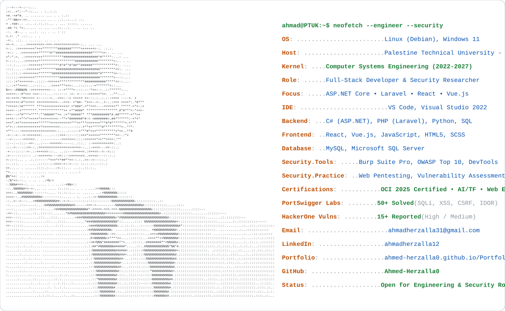

<a href="https://github.com/Ahmed-Herzalla0/Ahmed-Herzalla0">
  <picture>
    <source media="(prefers-color-scheme: dark)" srcset="./dark_mode_v6.svg">
    
  </picture>
</a>

 

<h3>🛠️ Tech Stack & Arsenal</h3>

  <b>Languages:</b> 
  
  
  
  
  
  
  
  

  <b>Frameworks & Web Technologies:</b> 
  
  
  
  
  
  

  <b>Security & Pentesting Toolkit:</b> 
  
  
  
  
  
  

  <b>Databases, Cloud & Dev Tools:</b> 
  
  
  
  
  
  
  
  

  📣 <b>Connect with me & discuss new opportunities:</b> 
  
  
  
  

  

---

<h3>⚡️ Engineering Profile & Journey</h3>

* 🎓 **Computer Systems Engineering** student at **Palestine Technical University - Kadoorie (PTUK)** (2022 - 2027).
* 💻 **Full-Stack Developer** specialized in building scalable, performant web applications using **ASP.NET Core**, **Laravel**, **React**, **Vue.js**, and relational databases.
* 🛡️ **Web Security & Pentesting:** Active security practitioner with deep focus on the **OWASP Top 10**, offensive security workflows, and defensive architecture.
* 🎯 **Key Practical Milestones:**
  * **PortSwigger Web Security Academy:** Successfully solved **50+ hands-on labs** covering SQL Injection, XSS, CSRF, IDOR, Authentication Bypasses, and business logic flaws.
  * **HackerOne Bug Hunting:** Discovered and reported **15+ high and medium-risk vulnerabilities** on real-world targets, helping organizations remediate security flaws.
* 📜 **Certifications:**
  * 🏅 **Oracle Cloud Infrastructure 2025** Certified Networking Professional
  * 🤖 **AI Programming** with Python and TensorFlow
  * ⚔️ **Web Ethical Hacking**
  * 🎨 **Front End Web Developer**

---

  
<b>📊 Detailed Technical Background & Security Arsenal ...</b>

   

  #### 🛡️ Cybersecurity & Web Penetration Testing
  * **Methodologies:** Manual security audits, black-box / gray-box web penetration testing, automated recon scripting.
  * **Vulnerabilities Audited:** SQLi, Stored/Reflected XSS, CSRF, IDOR, Broken Object Level Authorization (BOLA), Race Conditions, SSRF.
  * **Security Toolkit:** Burp Suite Professional, Nmap, DevTools, Linux environment, custom automation scripts.

  #### ⚙️ Software Architecture & Development
  * **Backend Architecture:** RESTful APIs, Clean Architecture, Dependency Injection, MVC, Authentication (JWT / Session), ORM (Entity Framework Core, Eloquent).
  * **Frontend Engineering:** Component-driven UI development (React, Vue.js), Responsive UI/UX with SCSS and Tailwind CSS.
  * **Database Design:** Normalization, indexing, complex querying, relational integrity on MySQL and Microsoft SQL Server.

---

  ⚡ Designed with precision by <a href="https://github.com/Ahmed-Herzalla0">Ahmed Herzalla</a>

